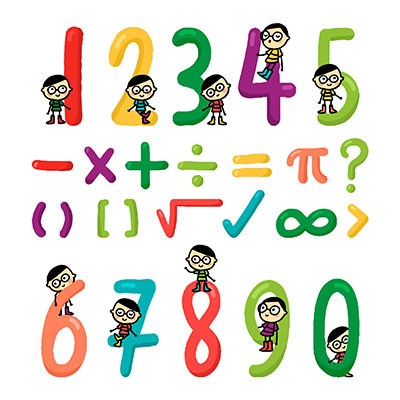
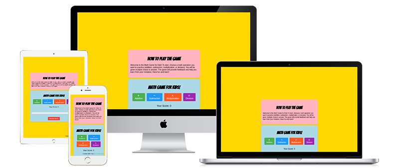
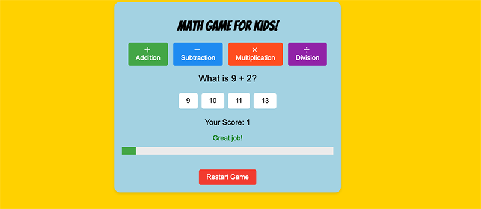
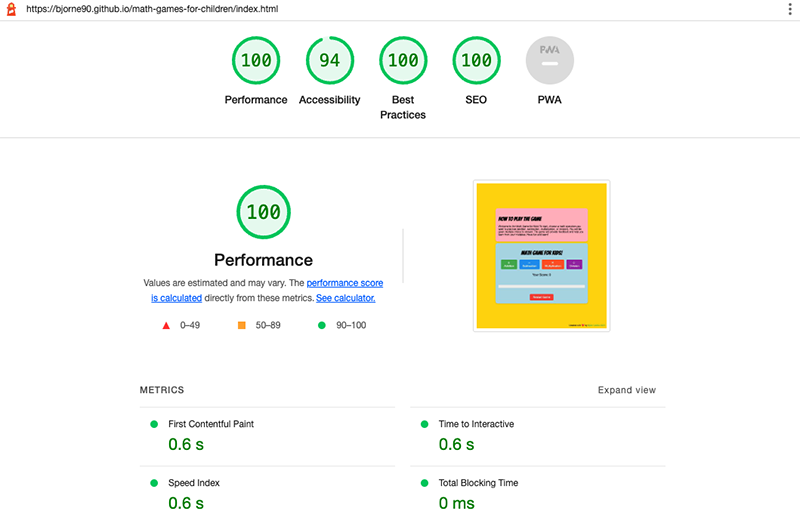

  

  <h3 align="center">Project 2 - Fun Math game for Kids</h3>

  

    My JavaScript project for Code Institute. A fun math game for kids.
     
     
    <a href="https://bjorne90.github.io/math-games-for-children/index.html">View Demo Website</a>
  

# Fun Math Game for Kids 🚀

A fun and interactive math game designed for children to learn and practice addition, subtraction, multiplication, and division.
The game features a colorful design, engaging animations, and a intuitive interface that adapts to diffrent screen sizes,
providing an enjoyable learning experience for kids.

## Features ✨
- **Colorful and  fun graphics:** Bright colors, intresting animations, and engaging design to grab children's 
attention and make the game visually appealing.
- **User-friendly interface:** The game is easy to navigate, with clearly labeled buttons and intutive controls suitable for
children.
- **Multiple game modes:** Children can choose from four different arithmetic operations to practice (addition, subtraction, multiplication, or division).
- **Personalized learning:** The game adapts to the child's skill level and adjusts the difficulty of the questions accordingly.
- **Positive reinforcement:** The game offers positive feedback and rewards for correct answers, encouraging children to keep playing and learning.

## How to Play 🎮
1. When the game starts, children can select the type of math operation they want to practice (addition, subtraction, multiplication, or division).
2. Once they select the operation, the game presents a series of questions that gradually increase in difficulty.
3. Children can answer the questions by selecting the correct answer from a set of multiple-choice options.
4. For each correct answer, the child receives points and positive feedback, such as a congratulatory message or a star.
5. If the child answers incorrectly, the game provides feedback and the correct answer so they can learn from their mistake.
6. As children progress through the game, the questions become progressively more challenging, helping them build their skills and confidence in math.

## Responsiveness 📱

The game is fully responsive and works well on different devices, such as phones and tablets. The layout and font sizes adapt to various screen resolutions to provide a seamless experience for children.

## Installation 💾

1. Clone the repository or download the source code.
2. Open the `index.html` file in your web browser.
3. Start playing and have fun!

## Technologies Used ⌨️

- HTML
- CSS
- JavaScript

## Bugs & Fixes 🪲

* Sometimes the same question is repeated one after the other **(Bug not solved)**
* Sometimes the questions are too difficult, probably a problem in the code. **(Bug not solved)**
* When the user is getting wrong answer the message should stay red, but turns back to green **(Bug not solved)**
* No other bugs where found while testing the game.

## Testing 📝

* The website has been tested in several different browsers such as Chrome, Safari and Firefox.
* I have tested that the page is responsive via Chrome devtools and via an Ipad.
* I have checked that the text is readable, that it is accessible to users.
* I have tested the form several times that it really works as intended and that all fields must be filled in.

## Features Left to Implement 🖥️

- Timed Challenges.
- Progressively harder levels.
- More math challenges for older kids, like equation.
- Language selector so more people can use the site
- Posibility to show how to calculate

## License 📄

This project is licensed under the MIT License. See the [LICENSE](license) file for details.

## Credit 💖

* Created with ❤️ by [Björn Centio](https://github.com/bjorne90)

* Logo and Favicon is downloaded from [FreePik](https://www.freepik.com/free-vector/hand-drawn-cartoon-mathematical-symbols_11521131.htm#query=math%20logo&position=44&from_view=keyword&track=ais)

* The idea and inspiration came from my daughter Felicia 🦋

## Contributing 💽

Contributions are welcome! If you would like to contribute to this project, please feel free to fork the repository, make your changes, and submit a pull request.